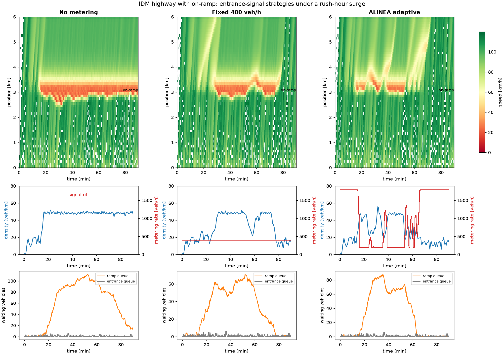
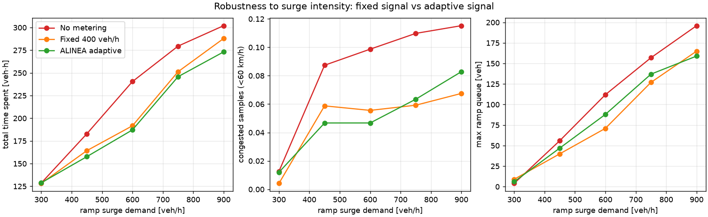

# fable51-traff — highway jams and adaptive entrance signals

A small, dependency-light Python simulation of highway traffic built on the
**Intelligent Driver Model (IDM)**, used to show how an **adaptive entrance
signal** (ramp metering with the ALINEA feedback law) mitigates the jams that
form where an on-ramp feeds a busy highway.



## What is modelled

* **Car following – IDM.** Every vehicle accelerates according to
  `a = a_max [1 - (v/v0)^4 - (s*/s)^2]`, with the desired gap
  `s* = s0 + v T + v Δv / (2 sqrt(a_max b))`. Treiber's standard "unstable"
  parameter set (`v0 = 120 km/h, T = 1.5 s, a = 0.73, b = 1.67, s0 = 2 m`) is
  used so that dense traffic is string-unstable and small perturbations grow
  into stop-and-go waves. Integration is a 0.1 s ballistic update.
* **Road.** A 6 km single-lane mainline with an on-ramp at 3 km and a 250 m
  acceleration lane. Vehicles arrive upstream as a Poisson process with a
  time-varying rate; a density detector sits 100–400 m downstream of the merge.
* **Merging.** A ramp vehicle picks the best gap along the acceleration lane;
  the merge is accepted when neither it nor its new follower has to brake harder
  than 3 m/s². After 6 s of waiting it *forces* its way in with a much smaller
  gap. These forced merges are the perturbations that trigger breakdown, and the
  resulting **capacity drop** (the merge section discharges at ≈1570 veh/h
  instead of its 1836 veh/h free-flow capacity) is what makes a jam persist long
  after the surge is over.
* **Entrance signals** (`traffic_idm/metering.py`):
  * `NoMetering` – the ramp is uncontrolled.
  * `FixedRateMetering` – a time-of-day fixed release rate.
  * `ALINEAMetering` – the adaptive feedback law
    `r(k+1) = r(k) + K_R (ρ_target − ρ_measured)`, which nudges the release rate
    to hold the downstream density just below the critical density, so the merge
    keeps flowing at capacity instead of breaking down.

## Results

Rush-hour scenario: mainline demand rises from 1250 to 1600 veh/h and ramp
demand from 200 to 600 veh/h between minute 10 and 30, then falls back
(90 simulated minutes, seed 1).

| Controller | Throughput [veh/h] | Mean speed [km/h] | Congested (<60 km/h) | Mean travel time [s] | Total time spent [veh·h] | Max ramp queue [veh] | Forced merges |
|---|---|---|---|---|---|---|---|
| No metering | 1499 | 91.5 | 9.9% | 385 | 240.4 | 112 | 337 |
| Fixed 400 veh/h | 1525 | 94.0 | 5.6% | 302 | 191.7 | 71 | 232 |
| ALINEA adaptive | 1525 | 95.0 | 4.7% | 295 | 187.2 | 88 | 201 |

Without a signal the merge breaks down at minute 15 and stays congested for the
rest of the run: the discharge rate after breakdown is lower than the
post-peak demand plus the ramp backlog, so the jam is self-sustaining. The
adaptive signal holds the downstream density near the target, restores free
flow by minute 65 and cuts total time spent (queueing included) by **22 %**.

A fixed signal tuned for this surge does almost as well, but it is tuned for
*this* surge. The demand sweep (`--sweep`) shows the adaptive controller
matching or beating it across surge intensities without retuning:



| Ramp surge [veh/h] | No metering [veh·h] | Fixed 400 veh/h [veh·h] | ALINEA adaptive [veh·h] |
|---|---|---|---|
| 300 | 128.6 | 128.2 | 128.8 |
| 450 | 182.9 | 164.3 | 157.7 |
| 600 | 240.4 | 191.7 | 187.2 |
| 750 | 279.5 | 251.3 | 245.8 |
| 900 | 302.1 | 287.9 | 273.2 |

`outputs/fundamental_diagram.png` overlays the detector's measured
density–flow points on the IDM equilibrium curve, showing the uncontrolled run
sitting on the congested branch while the metered runs stay near the capacity
point.

## Usage

```bash
pip install -e ".[dev]"
python -m traffic_idm                 # comparison figures + metrics table into ./outputs
python -m traffic_idm --sweep         # also the ramp-demand robustness sweep (~90 s)
python -m traffic_idm --duration 3600 --seed 3 --out results/
pytest                                # unit and scenario tests
```

Programmatic use:

```python
from traffic_idm import HighwayConfig, DemandProfile, HighwaySimulation, ALINEAMetering, summarize

cfg = HighwayConfig(duration=3600)
main = DemandProfile.rush_hour(base=1250, peak=1600, t_start=600, t_end=1800)
ramp = DemandProfile.rush_hour(base=200, peak=600, t_start=600, t_end=1800)
res = HighwaySimulation(cfg, ALINEAMetering(target_density=24, gain=60), main, ramp).run()
print(summarize(res))
```

## Layout

| File | Contents |
|---|---|
| `traffic_idm/idm.py` | IDM acceleration, equilibrium spacing, fundamental diagram |
| `traffic_idm/highway.py` | road, arrivals, acceleration-lane merging, detector, simulation loop |
| `traffic_idm/metering.py` | `NoMetering`, `FixedRateMetering`, `ALINEAMetering` |
| `traffic_idm/metrics.py` | throughput, speed, congestion, travel time, queue statistics |
| `traffic_idm/experiment.py` | rush-hour scenario, demand sweep, plotting, CLI |
| `tests/` | pytest suite |

## References

* Treiber, Hennecke & Helbing (2000), *Congested traffic states in empirical
  observations and microscopic simulations*, Phys. Rev. E 62, 1805.
* Papageorgiou, Hadj-Salem & Blosseville (1991), *ALINEA: a local feedback
  control law for on-ramp metering*, Transportation Research Record 1320.
